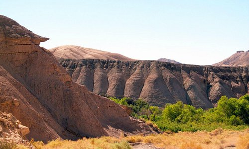

```{r setup, include=FALSE}
knitr::opts_chunk$set(echo = TRUE, message = FALSE, warning = FALSE)
```

<br>  

 

## The importance of foundation species on animal burrow patterns in Central California Deserts.


### Questions
1. Does the number of shrubs at a site predict number of burrows?  
2. Are burrows typically spatially associated with shrubs?  
3. Does shrub size predict burrow association frequencies?  
4. Does burrow opening size relate to association or distribution of burrows?  
5. How are burrows at a site spatially distributed?  
6. Do any of above associational and patterning data correlate with use patterns of burrows?  


### Experiment a.  
**Purpose**  
Qs 1 & 2 (and to a lesser extent pilot Q3)

**Methods**   
Sample sites with shrubs counted and geolocated.  
Ensure you do an 'open' site like Tecopa_open and Soda_lake etc.  
Get kml or shape files from Mario OR use a 50 x 50m tape, place centroid of lat long in middle. See regional sites file included herein for site_codes and lat long.  
Within the centered 50 x 50m plot at each site (or do whole site polygon), geotag every burrow and measure its diameter at widest point.

Two key measures: burrow location + its diameter.  
We then use shrub geodata with [st_distance](https://r-spatial.github.io/sf/reference/geos_measures.html) to get distances to shrub and also count up shrubs within sample area to get density.  


**Df**  
Datasheet.  

```{r}
library(tidyverse)
dfa <- read_csv("data/expta.csv")
knitr::kable(dfa)

```

**Metadata**  

```{r}
library(tidyverse)
dfa_meta <- read_csv("data/expta_metadata.csv")
knitr::kable(dfa_meta)

```


### Experiment b.  
Just notes, perhaps on second expedition in 2023.

**Purpose**  
Qs 2 & 3  

**Methods**   
Do shrub-open burrow survey similar to historical data.  
Measure x,y,z of shrub in m. Count number of burrows under a shrub.  
Do paired open microsites 1m away, count total n burrows.  
Do a total of 6 shrub-open pairs per site.  


### Experiment c.  
Just notes, perhaps on second expedition in 2023.  
Dig into burrow activity dynamics.  

**Purpose**  
Q 6.  

**Methods**   
Stake out burrows, cam trap, observe visually, and document use patterns.  
Explore disturbance, digging, and other animal sign proxy measures.  


### Big picture  
1. ideal for MSC with deeper data.  
2. can do a two-part paper and link to historical data I have if you can sample same sites this year.  


